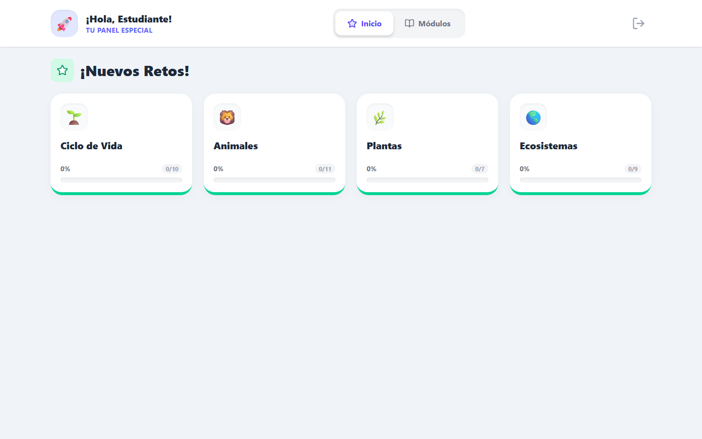
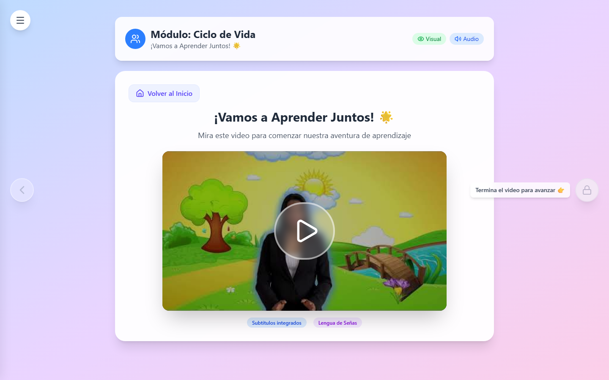
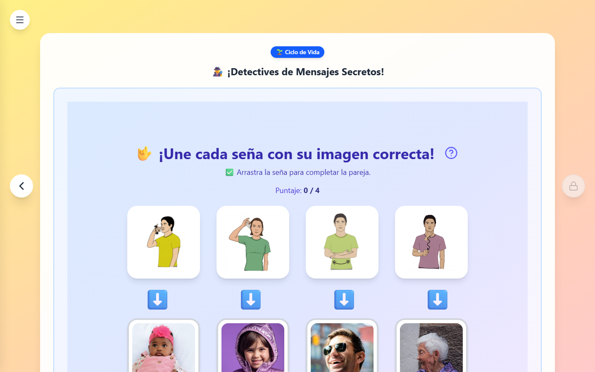
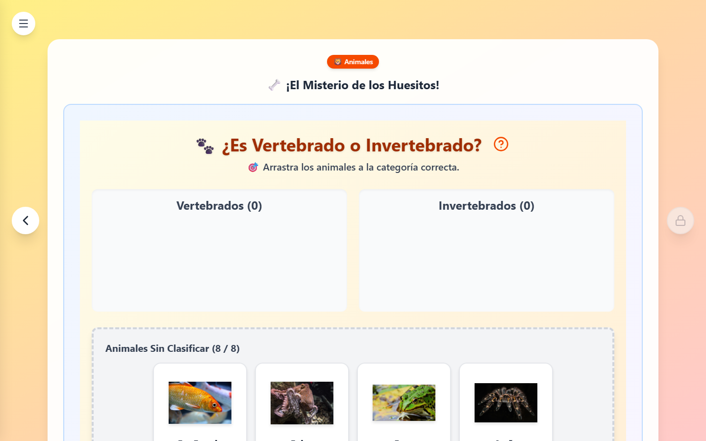
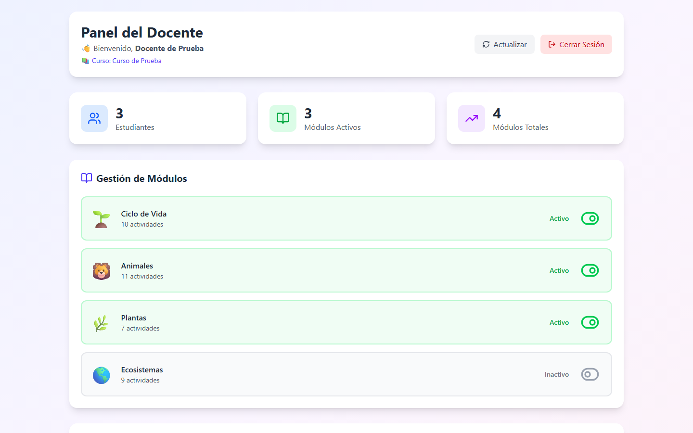

# OA Inclusivos – Auditiva

> Plataforma web de Objetos de Aprendizaje (OA) inclusivos para estudiantes con
> discapacidad auditiva, integrada con Moodle mediante LTI 1.1.

## Sobre el proyecto

Conjunto de Objetos de Aprendizaje de ciencias naturales diseñados para la
inclusión de estudiantes con discapacidad auditiva: cada contenido combina
videos con intérprete de lengua de señas y subtítulos, actividades interactivas
visuales (sin dependencia del audio) y retroalimentación inmediata. La
plataforma se lanza desde Moodle como herramienta externa LTI: no hay login
propio, la sesión y el rol (estudiante/docente) llegan firmados desde el aula
virtual, y el progreso se registra por usuario y por curso.

## Características

- **4 módulos temáticos** — Ciclo de Vida, Animales, Plantas y Ecosistemas:
  26 actividades interactivas y 11 videos (37 recursos en total).
- **Actividades en lengua de señas** — unir señas con imágenes, adivinar señas
  de los sentidos y vocabulario visual.
- **Actividades interactivas variadas** — drag & drop de clasificación, sopa de
  letras, dibujo libre, etiquetado de imágenes, ordenamiento de secuencias y
  asociación de conceptos.
- **Videos accesibles** — intérprete de lengua de señas y subtítulos integrados
  en cada video introductorio.
- **Panel del docente** — activar/desactivar módulos por curso, monitorear el
  progreso de cada estudiante y exportar reportes a Excel.
- **Progreso persistente** — marcador de posición por módulo: el estudiante
  retoma exactamente donde quedó.
- **Auditoría de accesibilidad automatizada** — axe-core + Playwright sobre
  todas las vistas, con reglas WCAG 2.1 A/AA.

## Capturas

| Panel del estudiante | Video con lengua de señas |
| :---: | :---: |
|  |  |
| **Actividad: unir señas** | **Actividad: clasificar drag & drop** |
|  |  |
| **Panel del docente** | |
|  | |

## Stack tecnológico

| Capa | Tecnologías |
| :--- | :--- |
| Frontend | React 19 · Vite 7 · Tailwind CSS 4 · Material UI 7 · React Router 7 |
| Actividades | @hello-pangea/dnd · react-sketch-canvas · react-player · xlsx (SheetJS) |
| Backend | Node.js · Express 5 · Sequelize 6 · express-session |
| Base de datos | MariaDB / MySQL (compartida con Moodle, tablas `mdl_oa*`) |
| Integración | LTI 1.0/1.1 con firma OAuth 1.0a (HMAC-SHA1) |
| Infraestructura | Docker Compose · nginx (SPA + streaming de videos) |
| Accesibilidad | axe-core · Playwright |

## Arquitectura

```
+---------+    LTI Launch (POST firmado OAuth 1.0a)   +------------------+
| Moodle  | ----------------------------------------> | Backend Express  |
| (aula)  |                                           |      :4000       |
+---------+                                           +--------+---------+
     ^                                                         | valida firma
     |                                                         | y crea sesion
     |                                                         v
     |                                              redirige al frontend
     |                                                         |
+----+---------+        API REST (cookie de sesion)            v
|   MariaDB /  | <-------------------------------  +------------------+
|    MySQL     |   mdl_oa, mdl_oa_curso,           | Frontend (nginx) |
|  (de Moodle) |   mdl_oa_status,                  |      :3000       |
|              |   mdl_oa_user_progress            +------------------+
+--------------+
```

El backend usa la **misma base de datos de Moodle** y crea allí sus tablas
mediante migraciones y seeders automáticos al arrancar.

## Requisitos previos

- Una instancia de **Moodle** desplegada con Docker (este proyecto usa su red
  externa `moodle-data_moodle-net` y su base de datos).
- **Docker** y Docker Compose para el despliegue.
- **Node.js 18+** solo para desarrollo local.

## Despliegue rápido (Docker)

1. Clonar el repositorio:

   ```bash
   git clone https://github.com/ashcroft08/oa-inclusivos-auditiva.git
   cd oa-inclusivos-auditiva
   ```

2. Crear el archivo de secretos a partir de la plantilla y completarlo:

   ```bash
   cp .env.example .env
   ```

   De ahí `docker-compose.yml` toma `DB_PASSWORD`, `LTI_CONSUMER_KEY`,
   `LTI_SHARED_SECRET` y `SESSION_SECRET`. El archivo `.env` está en
   `.gitignore`: las credenciales nunca se commitean.

3. Colocar los videos de los módulos en la carpeta `videos_data/` (nginx los
   sirve en la ruta `/Videos/`).

4. Levantar los servicios:

   ```bash
   docker compose up -d --build
   ```

   - Frontend: `http://localhost:3000`
   - Backend: `http://localhost:4000`

5. Registrar la herramienta externa en Moodle (ver siguiente sección).

## Configuración de la herramienta LTI en Moodle

En **Administración del sitio → Extensiones → Herramienta externa**, crear una
herramienta con:

| Parámetro | Valor |
| :--- | :--- |
| Nombre | OA Inclusivos (o el que prefieras) |
| URL de la herramienta | `http://<tu-servidor>:4000/lti-launch` |
| Consumer key | Valor de `LTI_CONSUMER_KEY` |
| Shared secret | Valor de `LTI_SHARED_SECRET` |
| Versión de LTI | 1.0/1.1 |

Al lanzar la herramienta, Moodle envía el usuario, el curso y los roles; el
backend valida la firma y redirige al frontend con la sesión ya creada. Los
usuarios con rol de docente ven el panel de gestión; los estudiantes entran
directo a los módulos.

## Desarrollo local

```bash
# Backend (http://localhost:4000)
cd backend
npm install
cp .env.example .env   # completar credenciales de la BD de Moodle
npm run dev            # nodemon con recarga automática

# Frontend (http://localhost:5173)
cd frontend
npm install
npm run dev            # definir VITE_API_URL=http://localhost:4000
```

> Sin una sesión LTI activa la app muestra la vista de "sin sesión". Para
> desarrollo, el `AuthContext` admite credenciales de prueba vía `localStorage`
> (`oa_user`, `oa_course`, `oa_roles`).

## Auditoría de accesibilidad

```bash
cd frontend
npm run dev                      # la app debe estar corriendo en :5173
npm run audit:accessibility
```

Recorre todas las vistas con axe-core sobre Playwright (reglas WCAG 2.0 A/AA y
2.1 AA) y genera `accessibility-report.html` y `accessibility-report.json` con
los resultados por vista.

## Estructura del repositorio

```
├── backend/                # API REST + integración LTI (Express + Sequelize)
│   └── src/
│       ├── config/         # Configuración (BD, CORS, sesión, LTI)
│       ├── controllers/    # Controladores de rutas
│       ├── database/       # Migraciones y seeders automáticos
│       ├── middleware/     # Manejo de errores y utilidades LTI
│       ├── models/         # Modelos Sequelize (tablas mdl_oa*)
│       ├── routes/         # Rutas: LTI, OA, progreso, cursos, health
│       └── services/       # Lógica de negocio (LTI, OA, progreso, cursos)
├── frontend/               # SPA React + Vite
│   └── src/
│       ├── components/     # Vistas y 27 actividades interactivas
│       ├── context/        # AuthContext y ProgressContext
│       ├── data/           # Definición de módulos y actividades
│       └── services/       # Clientes HTTP de la API
├── docs/
│   ├── lti-integration.md  # Guía de referencia de la integración LTI
│   └── screenshots/        # Capturas de la plataforma
└── docker-compose.yml      # Orquestación frontend + backend
```

## Licencia

Este proyecto está bajo la licencia MIT. Ver [LICENSE](LICENSE).
